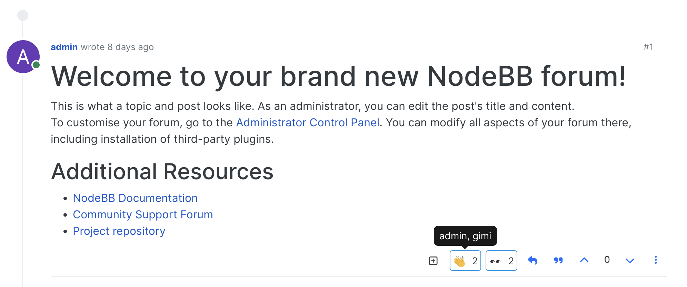
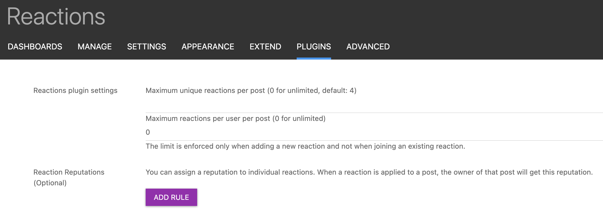

# nodebb-plugin-reactions
Reactions plugin for NodeBB

This plugin requires nodebb-plugin-emoji to be active.

# Installation
Install via one-click activation in the Admin Control Panel or run the following command:

    npm i @nodebb/nodebb-plugin-reactions

# Screenshots

## Reactions:

## ACP:

